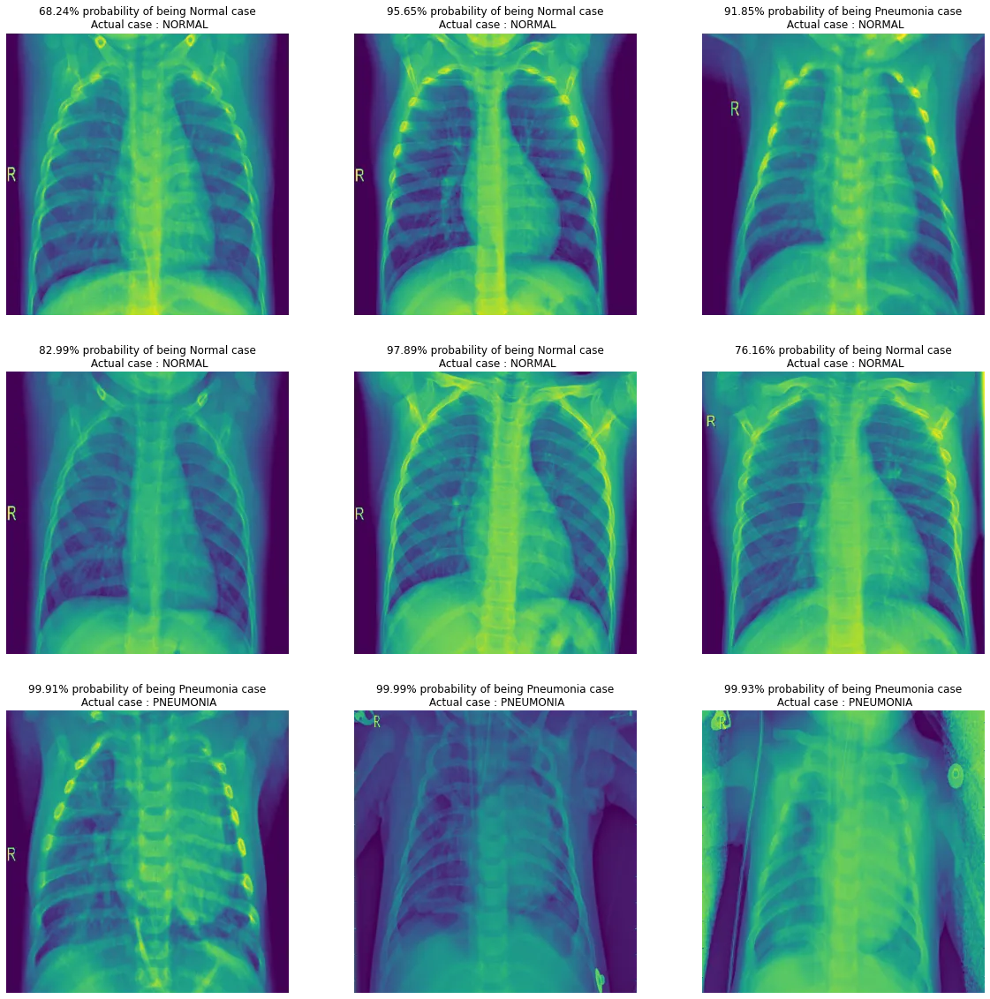

# Pneumonia X-Ray Classifier (Streamlit App) 🏥🔬

This repository hosts a web application built with Streamlit that classifies chest X-ray images as either 'NORMAL' or 'PNEUMONIA' using a pre-trained TensorFlow/Keras deep learning model. ☁️🩺

## Table of Contents

* [Introduction](#introduction)
* [Features](#features)
* [Files in this Repository](#files-in-this-repository)
* [Model Details](#model-details)
* [How to Run Locally](#how-to-run-locally)
* [Dependencies](#dependencies)
* [Results](#results) 
* [Contribution](#contribution)
* [License](#license)

## Introduction

Early and accurate diagnosis of pneumonia from chest X-ray images is crucial for patient care. 👨‍⚕️ This project provides a user-friendly interface to leverage a deep learning model for quick initial screening. ⚡ Users can upload an X-ray image, and the application will predict whether the image indicates 'NORMAL' lungs or 'PNEUMONIA', along with the confidence of the prediction. 📊

## Features

* **User-Friendly Interface**: Built with Streamlit for an intuitive web application experience. 🌐
* **Image Upload**: Allows users to upload JPG, JPEG, or PNG X-ray images. 🖼️⬆️
* **Real-time Classification**: Processes the uploaded image and provides instant predictions. ⏱️
* **Confidence Score**: Displays the confidence level for the predicted class. ✨
* **All Class Probabilities**: Shows the probability for each possible class. 📈
* **Custom Styling**: Includes basic CSS styling for a cleaner look. 🎨

## Files in this Repository

* `app.py`: This is the main Streamlit application script. It handles:
    * Loading the pre-trained Keras model. 🧠
    * Defining the image preprocessing steps. ⚙️
    * Setting up the Streamlit UI, including file uploader, display elements, and classification button. 🖥️
    * Executing predictions and displaying results. ✅
* `requirements.txt`: Lists all the Python dependencies required to run the `app.py` script. 📦
* `medical_image_classifier_model.h5`: ( **You need to add this file to your repository** ) This is the pre-trained TensorFlow/Keras model file (`.h5` format). The `app.py` expects this file to be in the same directory. 📁

## Model Details

The core of this application is a deep learning model trained for binary classification of chest X-ray images. 🧠 While the training code is not part of this repository, the `app.py` loads a `.h5` file, indicating a pre-trained Keras model. This model is responsible for distinguishing between 'NORMAL' and 'PNEUMONIA' cases based on image features. The `IMG_HEIGHT` and `IMG_WIDTH` are configured to 500 pixels, and images are converted to grayscale and normalized before being fed to the model. 📏🖼️

## How to Run Locally

To run this application on your local machine, follow these steps:

1.  **Clone the repository:** ⬇️
    ```bash
    git clone https://github.com/khawajaazfar/Pneumonia-X-Ray-Classifier
    cd Pneumonia-X-Ray-Classifier
    ```
2.  **Place the Model File:** Ensure your `medical_image_classifier_model.h5` file is placed in the root directory of this repository (the same directory as `app.py`). 📥
3.  **Create a virtual environment (recommended):** 🐍
    ```bash
    python -m venv venv
    source venv/bin/activate  # On Windows: `venv\Scripts\activate`
    ```
4.  **Install dependencies:** 🛠️
    ```bash
    pip install -r requirements.txt
    ```
5.  **Run the Streamlit application:** ▶️
    ```bash
    streamlit run app.py
    ```
    This will open the application in your default web browser. 🌐

## Dependencies

The necessary Python libraries are listed in `requirements.txt`: 📋

* `streamlit` [cite: 1]
* `tensorflow==2.16.1` [cite: 1]
* `numpy` [cite: 1]
* `Pillow` [cite: 1]

## Results

When you interact with the Streamlit application, after uploading an X-ray image and clicking the "Classify Image" button, the app will display the prediction and its confidence.

Here's an example of what the output might look like in the web application:



This screenshot illustrates the application's interface after a classification. It shows the uploaded image, the model's prediction (e.g., 'PNEUMONIA' or 'NORMAL'), and the associated confidence score. The "All Class Probabilities" section provides a detailed breakdown of the model's certainty for each class.

## Contribution

Feel free to fork this repository, open issues, or submit pull requests. 🤝 Any improvements, bug fixes, or new features are welcome! ✨

## License

This project is open-source and available under the [MIT License](LICENSE). 📝
